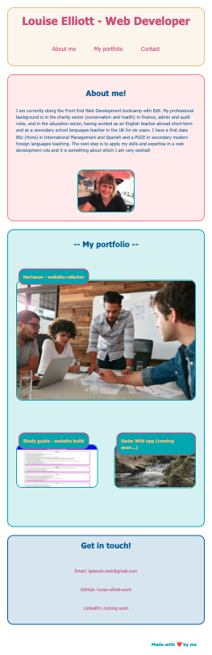
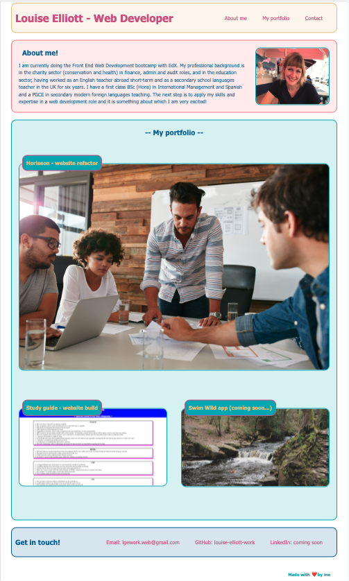

# <Portfolio website build>

## Description

The aim of this webpage is to provide a profile page that can be added to on an ongoing basis. 

It gives potential employers key information and showcases skills and talent by providing images of, and clickable links to, applications refactored and built so far.

It includes three main sections: a summary profile with a photo, the portfolio and contact details.

The layout is designed to be clear and easy to navigate for the user.

The branding is consistent throughout by the use of colour and font.

The build involved:
    - writing the HTML file using semantic elements where possible and links that can be clicked to open.
    - writing the CSS file to create the layout, using flexbox, grid, variables and media queries, ensuring ease of use on a range of devices and viewport widths.
    
## Installation

n/a

## Usage

The webpage has a header with a title and navigation menu of three items at the top, which link to the sections below when clicked. There is a clear section for each of the three items. First is the profile section with a summary and photo. Next is the portfolio section with clickable images for each of the apps developed so far. The first app is shown larger than the others in order to lead users to open it first. At the bottom are contact details with links that can be clicked to open. In the footer is the signature.

Website link: https://louise-elliott-work.github.io/website-build-portfolio

## License

This project is MIT licensed.
